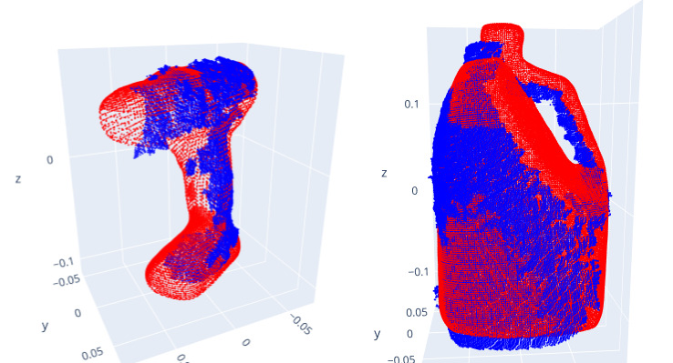
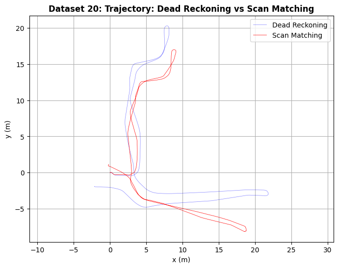
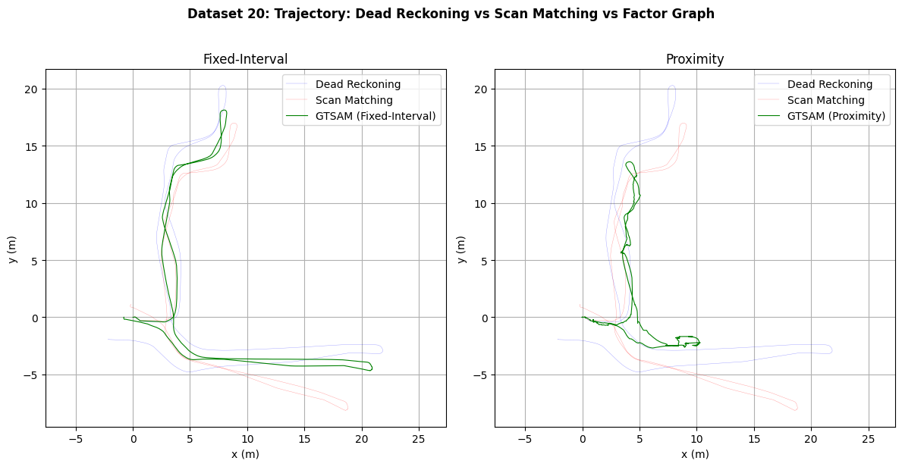
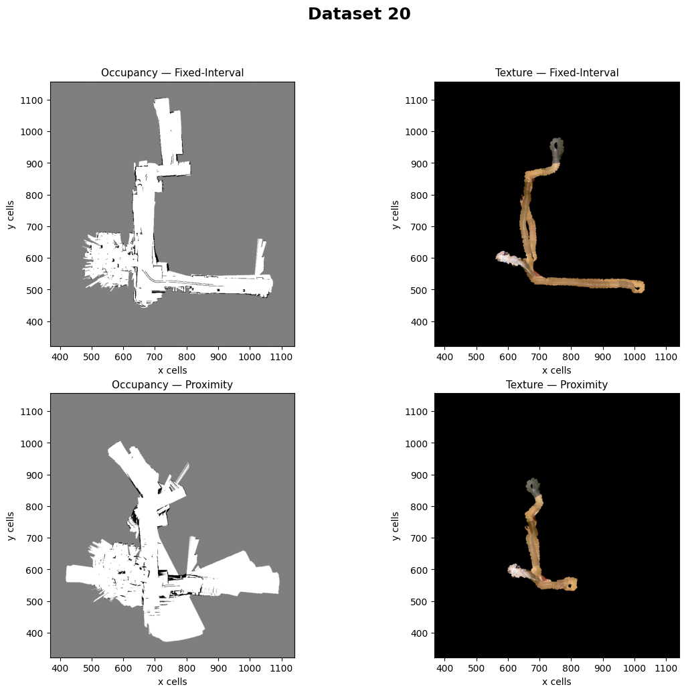

# Project 2: LiDAR-Based SLAM
**Course:** ECE 276A: Sensing & Estimation in Robotics  
**Institution:** University of California San Diego

## Academic Integrity Notice
⚠️ **Source Code Withheld**
To strictly comply with university academic integrity policies and course collaboration guidelines, the actual source code for this assignment is hidden from this public repository. The work presented here is entirely my own. Recruiters, researchers, or prospective employers are welcome to contact me directly to discuss my methodology or to request private access to the source code for review.

---

## Project Setup
This project implements a Simultaneous Localization and Mapping (SLAM) pipeline using data from a custom differential-drive robot. 

The robot's hardware and sensor suite includes:
* **Encoders:** Track the rotations of the four wheels at 40 Hz to provide linear velocity.
* **IMU:** An inertial measurement unit providing linear acceleration and angular velocity, from which the yaw rate is extracted.
* **LiDAR:** A Hokuyo UTM-30LX horizontal scanner with a 270° field of view and a 30-meter maximum range.
* **RGBD Camera:** A Kinect sensor providing RGB and disparity images to capture floor textures.

---

## Mathematical and Theoretical Formulation
The overarching goal is to estimate the robot's trajectory and construct a 2-D occupancy grid and texture map of its environment. 

**1. Odometry Kinematics:**
The robot's pose at time $t$ in the world frame is defined as $x_{t}=[x_{t},y_{t},\theta_{t}]^{T}\in SE(2)$. Given control inputs $u_{t}=[v_{t},\omega_{t}]^{T}$ (linear velocity from encoders and yaw rate from IMU), the discrete-time differential-drive motion model is:

$$
x_{t+1}=x_{t}+\Delta t
\begin{bmatrix}
v_{t}\mathrm{sinc}(\frac{\omega_{t}\Delta t}{2})\cos(\theta_{t}+\frac{\omega_{t}\Delta t}{2}) \\ 
v_{t}\mathrm{sinc}(\frac{\omega_{t}\Delta t}{2})\sin(\theta_{t}+\frac{\omega_{t}\Delta t}{2}) \\ 
\omega_t
\end{bmatrix}
$$

**2. LiDAR Scan Matching (ICP):**
To correct drift, an Iterative Closest Point (ICP) algorithm finds the optimal 2-D rigid-body transformation (rotation $R$ and translation $p$) between consecutive LiDAR scans by minimizing the squared Euclidean distance between associated points:

$$\min_{R\in SO(2),p}\sum_{i,j\in\Delta}||m_{i}-(Rz_{j}+p)||_{2}^{2}$$

**3. Occupancy Grid Mapping:**
The map is updated using a recursive Bayesian filter in log-odds form. The log-odds representation $L_{t}(m_{i})$ of a cell $m_{i}$ being occupied is updated via:

$$L_{t}(m_{i})=L_{t-1}(m_{i})+\log(\frac{P(m_{i}|z_{t},x_{t})}{1-P(m_{i}|z_{t},x_{t})})$$

**4. Pose Graph Optimization:**
To mitigate accumulated drift, a pose graph is optimized by minimizing the sum of squared, weighted residual errors across all relative pose measurements in the graph:

$$
\min_{\{T_{i}\}} \sum_{(i,j) \in \mathcal{E}} \|\| W_{ij}\log(\overline{T}_{ij}^{-1}T_{i}^{-1}T_{j}^{-1})^{\vee} \|\|_{2}^{2}
$$

---

## Technical Approach
The SLAM pipeline was developed in four primary stages:

* **Dead-Reckoning Odometry:** Established a baseline trajectory by fusing temporally synchronized wheel encoder velocities and IMU yaw rates using an exact analytical solution for the differential-drive motion model.
* **Scan Matching via ICP:** Refined the initial trajectory by aligning consecutive 2D LiDAR scans. Implemented a robust ICP algorithm utilizing k-d trees for nearest-neighbor search, dynamic outlier rejection, and Singular Value Decomposition (SVD) to solve Wahba's problem for optimal alignment.
* **Occupancy and Texture Mapping:** Projected valid LiDAR hits into the global frame and updated a discrete 2D grid using log-odds probabilities and OpenCV's polygon-filling for efficient free-space raycasting. Floor texture maps were generated by projecting RGBD Kinect data onto the ground plane.
* **Global Optimization (GTSAM):** Addressed long-term cumulative drift using Georgia Tech Smoothing and Mapping (GTSAM) to perform pose graph optimization. Compared two loop-closure strategies—fixed-interval and proximity-based—using Cauchy M-estimators to robustly reject false positive constraints.

---

## Results
The implementation demonstrated that while local scan matching drastically improves upon dead-reckoning odometry, global pose graph optimization (specifically with proximity-based loop closures) is strictly necessary to correct long-term drift and yield a structurally perfect map.

### ICP Warm-Up: 3D Object Pose Estimation
Prior to applying scan matching to the 2D LiDAR data, the core ICP methodology was validated through a 3D point-cloud registration warm-up.

### Trajectory Refinement

### Final Occupancy Grid & Texture Map

---

## Full Project Report
For a comprehensive analysis of the methodology, mathematical derivations, parameter tuning, and detailed performance metrics across multiple datasets, please refer to the full project report included in this repository:

📄 **[Read the Full Project Report (PDF)](ECE_276A_PR_2_Report.pdf)**
